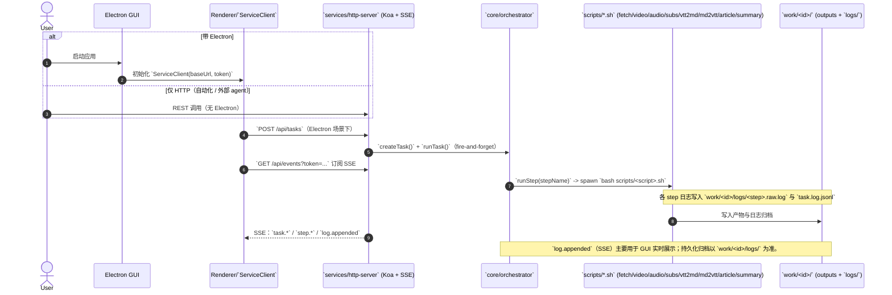

# Video-Learner 项目知识文档

> 本文面向「后来者」和「未来的自己」，希望在几分钟内弄清整个项目在做什么、长什么样、以及关键约束是什么。

---

## 一、项目概述

**Video-Learner** 是一个 YouTube 视频处理流水线工具，实现了从单个 YouTube URL 到「下载 → 字幕/转录 → 结构化文章 → 重点总结」的自动化流程，并同时支持：

- **Electron 桌面客户端**：通过 GUI + 本地 HTTP/SSE + **`core/orchestrator`** + SQLite，对各步骤进行可视化编排与重试；
- **Agent Service（HTTP）**：同一编排内核，供 API / 外部 agent 驱动（无界面）。

> **已废弃**：历史上一键 shell 入口 `scripts/run.sh` 现为薄壳（打印说明后非零退出），不再执行流水线。见 `docs/plans/2026-03-22-deprecate-cli-design.md`。

**核心能力：**

1. **视频/音频下载**：使用 `yt-dlp` 下载最高 1080p（不追求 4K），支持后台独立下载。
2. **双语字幕获取**：自动检测并下载中/英字幕，优先原创字幕，其次自动字幕。
3. **转录生成**：将 VTT 字幕转换为带 \[mm:ss\] 时间戳、自动去重的 Markdown 逐字稿。
4. **文章整理**：用 Claude 将逐字稿整理为结构化的 `article.md`。
5. **智能总结**：结合用户 FOCUS，生成包含 TL;DR / Outline / Key Points / Action Items / Terms 的 `summary.md`。
6. **任务管理 & GUI**：Electron 前端配合本地 orchestrator 和 WebSocket，提供任务列表、进度与日志流、双语字幕切换等能力。

---

## 二、目录结构与职责

只列出关键目录与文件，省略若干测试脚本与杂项：

```bash
Video-Learner/
├── CLAUDE.md                  # 流水线执行标准 & meta 约定（强约束）
├── README.md                  # 对外 README（简略版）
├── package.json               # 根级 NPM 脚本：启动 Electron、安装依赖
├── scripts/                   # 分步 shell 脚本 + 工具（由编排层 spawn）
│   ├── run.sh                 # 【已废弃】薄壳；仅提示改用 GUI / Agent Service
│   ├── install.sh             # 安装系统依赖（yt-dlp / ffmpeg / jq 等；写作引擎需自行安装）
│   ├── fetch_info.sh          # Electron 路径：Step fetch（yt-dlp 拉取基础信息）
│   ├── download_video.sh      # Step video：视频下载（合并流 + DASH 回退）
│   ├── download_audio.sh      # Step audio：音频下载/提取
│   ├── download_subs.sh       # Step subs：字幕下载（中/英）
│   ├── convert_vtt_md.sh      # Step vtt2md：VTT → Markdown 的封装
│   ├── convert_md_vtt.sh      # Step md2vtt：Markdown → VTT 的封装
│   ├── llm_engine.sh          # 写作引擎路由：claude/opencode（统一入口）
│   ├── opencode_server.sh     # opencode serve 生命周期管理（ensure/health/stop）
│   ├── generate_article.sh    # Step article：通过 llm_engine 生成 article.md
│   ├── generate_summary.sh    # Step summary：通过 llm_engine 生成 summary.md
│   ├── vtt_converter.py       # 纯 Python：VTT → Markdown（去重/清洗）
│   ├── md2subtitle.py         # 纯 Python：Markdown → VTT/SRT
│   ├── db.sh                  # Bash 侧 SQLite 工具（tasks/steps/downloads）
│   ├── settings.example.conf  # 全局配置样例（输出语言、画质等）
│   ├── settings.conf          # 全局配置（本机私有，不一定存在；从 example 复制）
│   ├── article_prompt.txt     # Claude 文章提示词模板
│   ├── summary_prompt.txt     # Claude 总结提示词模板
│   ├── test_opencode_smoke.sh # OpenCode serve+HTTP 冒烟测试（可选）
│   └── test_*.sh / test_*e2e.sh # 若干端到端/集成测试脚本
├── electron/                  # Electron 桌面客户端 & Orchestrator
│   ├── package.json
│   └── src/
│       ├── main.js            # Electron 主进程，创建窗口 & IPC & WebSocket
│       ├── preload.js         # 暴露安全 API 给前端
│       ├── db.js              # Node 侧 SQLite 封装（操作 work/database.sqlite）
│       ├── websocket-server.js# 本地 WebSocket server，向前端推日志和状态
│       ├── orchestrator.js    # Orchestrator：按步骤调用 scripts/* 并更新 DB
│       └── renderer/
│           └── index.html     # 前端 UI（任务列表、详情、播放器、字幕区等）
├── docs/
│   ├── PROJECT_KNOWLEDGE.md   # 本文：项目知识总览
│   ├── DEPLOYMENT.md          # 新机器部署：settings.conf、环境变量、依赖与安全注意
│   ├── GIT_FLOW.md            # 分支规范；合并须 --no-ff
│   └── plans/                 # 历史设计文档与实现笔记（orchestrator / vtt 去重等）
├── start-electron.sh          # 从仓库根目录启动 Electron 的脚本
└── work/                      # 运行时输出（执行后生成，不纳入版本控制）
    ├── index.jsonl            # CLI 模式任务索引（按行记录任务概况）
    ├── database.sqlite        # Electron 模式下的任务/步骤状态数据库
    └── <id>/                  # 单个 URL 的输出树（id = sha1(url) 前 12 位）
        ├── media/             # 媒体文件
        │   ├── video.mp4
        │   ├── audio.m4a
        │   └── video_download.log
        ├── transcript/        # 转录与字幕
        │   ├── subs/          # 原始字幕 vtt（区分 en/zh、orig/auto）
        │   ├── original_en.md # 英文逐字稿（带 [mm:ss]；去重）
        │   ├── original_zh.md # 中文逐字稿
        │   ├── original_en.vtt
        │   └── original_zh.vtt
        └── writing/           # 生成内容
            ├── article.md     # 结构化文章
            └── summary.md     # 总结（受 FOCUS 影响）
```

---

## 三、运行模式与入口

- **正式入口（唯一实现路径）**  
  - **GUI（Electron）**：`bash start-electron.sh`；前端通过 **HTTP + SSE** 与 **`services/http-server`** 通信，后者调用 **`core/orchestrator`**。  
  - **Agent Service**：`npm run agent:serve`，直接暴露同一 HTTP API，无 Electron 亦可驱动任务。  
  - 二者均将任务与步骤状态写入 **`work/database.sqlite`**，并 `spawn` 各 **`scripts/*.sh`** 完成实际下载与生成。
- **已废弃**  
  - **`scripts/run.sh`**：曾为「一键 CLI」，现为**薄壳**（打印弃用说明、`exit 1`），**不再调用任何步骤脚本**。设计说明见 `docs/plans/2026-03-22-deprecate-cli-design.md`。

> 记忆点：**编排层 + 分步脚本** 是唯一流水线实现；差异仅在「是否带 Electron UI」。

### 3.1 调用链路时序图（GUI / Agent Service）



### 3.2 运行入口约定（重要）

- 新功能与修复应落在 **`core/orchestrator`** 或对应 **`scripts/<step>.sh`**，不要恢复与编排层并行的「一体化 shell 流水线」。
- `work/index.jsonl` 仍可由编排层追加（追溯）；**权威任务状态以 SQLite 为准**。
- **`runTask`（B 层串行调度）**：`createTask` 之后由 HTTP 或 Electron 触发；内部用 `core/orchestrator/schedule.js` 循环计算就绪集并按 **主链 / 次优先** 出队调用 `runStep`，直至无步可调度（语义见 `docs/plans/2026-03-22-orchestrator-dag-scheduler.md`）。Electron `Orchestrator.run()` 委托 **`core.runTask`**，与 Agent Service 共用同一顺序。
- **`runStep` A 层（必需物）**：在 spawn 各 `scripts/*.sh` 之前，校验 URL、任务目录可写或可创建、`transcript/subs` 下是否有 `.vtt`、`original_*.md`、`writing/article.md` 等（见 `docs/plans/2026-03-22-runstep-prerequisites.md`）；**不**根据上游步骤的 SQLite 状态拦截。仅因 A 层失败时**不会**发出 `step.started`。步骤的 B 层依赖、就绪判定与 **默认单队列串行** 出队由 **B 层** DAG/调度设计（`docs/plans/2026-03-22-orchestrator-dag-scheduler.md`）约束；真并行 `runStep` 为可选演进。

---

## 四、流水线阶段（编排层 + 分步脚本）

以下阶段由 **`core/orchestrator`** 按 Step 调用对应 **`scripts/*.sh`**，GUI 与 Agent Service 共用。**`scripts/run.sh` 已废弃**，勿再作为入口。

### 4.1 任务参数（GUI / `POST /api/tasks`）

创建任务时的主要字段（与旧文档中的 CLI 参数概念对应）：

- **`url`**（必填）、**`focus`**、**`mode`**（`both` | `video` | `audio` | `transcript`）、**`force`**、**`output_lang`** 等；路由与 body 定义见 `services/http-server`。
- **`WRITING_ENGINE`**：通过**进程环境变量**传入（在启动 `npm run agent:serve` 或 Electron 前导出），由 `scripts/llm_engine.sh` 与 `scripts/settings.conf` 中的 `WRITING_ENGINE_DEFAULT` 解析；支持 `claude` / `opencode`，非法或未设时回退 `opencode`。

### 4.2 执行阶段（逻辑视角）

1. **Step 0：获取信息（info/fetch）**
   - 使用 `yt-dlp --dump-json` 拉取标题、时长、语言等。
   - 计算 `id = sha1(url)` 前 12 位，建立 `work/<id>/` 目录。
   - 编排层可追加 `work/index.jsonl` 记录（追溯用）。

2. **Step 1：视频下载（video）**
   - 由 `scripts/download_video.sh` 执行（是否后台化由编排层/脚本策略决定）。
   - 下载策略：
     - 优先合并格式（progressive）：单 MP4 文件（bestvideo+bestaudio，最高 1080p）。
     - 失败时回退到 DASH：分别下载视频/音频流，再用 `ffmpeg` 合并。
   - 结果落盘：
     - `work/<id>/media/video.mp4`
     - `work/<id>/media/video_download.log`
   - **关键：下载失败不阻塞后续转录/总结。**

3. **Step 2：音频下载/提取（audio）**
   - 使用 `yt-dlp -x --audio-format m4a`。
   - 输出 `work/<id>/media/audio.m4a`，供未来接入 ASR 使用。

4. **Step 3：字幕下载 + 转录（subs + vtt2md）**
   - 语言与优先级：
     - 英文：`en-orig` > `en`（auto）
     - 中文：`zh-Hans`/`zh-Hant`（orig/auto）> `zh`（auto）
   - 字幕下载：`yt-dlp --write-subs/--write-auto-subs` + `--sub-langs`。
   - 转录：
     - `vtt_converter.py`：VTT → `original_en.md` / `original_zh.md`（\[mm:ss\]，去重）。
     - `md2subtitle.py`：反向生成 `original_en.vtt` / `original_zh.vtt`，方便前端播放。

5. **Step 3.5：文章生成（article）**
   - 源文件：优先 `original_en.md`，否则 `original_zh.md`。
   - 模板：`scripts/article_prompt.txt`。
   - 工具：通过 `scripts/llm_engine.sh` 调用写作引擎（`claude` / `opencode`）。
   - 输出：`work/<id>/writing/article.md`。

6. **Step 4：总结生成（summary）**
   - 源文件：`writing/article.md`。
   - 模板：`scripts/summary_prompt.txt`。
   - 输入：FOCUS（命令行参数 / 之前记录）。
   - 工具：通过 `scripts/llm_engine.sh` 调用写作引擎（`claude` / `opencode`）。
   - 输出：`work/<id>/writing/summary.md`。

### 4.3 索引与文件级复用

- **任务索引：`work/index.jsonl`**
  - 每行一条 JSON，记录 `url/id/ts/title` 等（编排层或历史工具可能追加）。
  - 同一 `id` 多次执行时，具体合并策略以当前实现为准；**权威状态见 SQLite**。
- **文件存在性即状态**：
  - `video.mp4` 存在且大小 > 阈值 → 可视为已成功下载，可标记 `download_status=skipped_existing`。
  - `original_en/zh.md` 存在且内容长度 > 阈值，且未强制重跑 → 可复用转录结果，只做后续文章/总结。

---

## 五、Electron Orchestrator & GUI 流水线

### 5.1 总体架构

- **主进程（`electron/src/main.js`）**
  - 创建应用窗口。
  - 初始化 WebSocket server 与 orchestrator。
  - 暴露若干 IPC 通道给 renderer（前端页面）。

- **Orchestrator（`electron/src/orchestrator.js`）**
  - 将一条流水线拆分为多个可单独执行的 Step：
    - `fetch` / `video` / `audio` / `subs` / `vtt2md` / `md2vtt` / `article` / `summary`。
  - 每步调用对应的 `scripts/*.sh`，并通过 `db.js` 更新 SQLite 中的 `tasks` / `steps` / `downloads`。
  - 提供高层 API：
    - `run(url, options)`：按顺序执行所有启用的 Step。
    - `runStep(taskId, stepName, options)`：单步重试或补跑。
  - **收尾（finalize）机制（重要）**：
    - 当整条流水线跑完后，编排层会再基于文件产物（`original_*.md` / `writing/article.md` / `writing/summary.md`）对 step 状态做一次一致性纠偏（例如产物已存在但 step 标记失败/待执行）。
    - 会发出 `task.finalized` 事件（包含关键 outputs 是否存在），用于让 GUI/SSE 订阅方在任务结束瞬间拿到更可靠的最终状态。
    - 若本次任务触发了 OpenCode serve 的启动，且当前没有其他任务在运行，则会在 finalize 阶段尝试关闭该 serve（避免后台常驻占用端口）。

- **SQLite 状态存储（`work/database.sqlite`）**
  - 主要表结构（简化）：
    - `tasks`：任务级信息（url / title / duration / created_at / focus / output_lang 等）。
    - `steps`：按 step 维度记录 `status`（pending/running/completed/failed）、`attempts`、`error` 等。
    - `downloads`：视频下载详情（文件大小、格式、错误信息等）。

- **WebSocket 通信（`electron/src/websocket-server.js`）**
  - 将 orchestrator 的事件（日志输出、任务创建/更新、步骤开始/结束等）通过 WebSocket 推送给前端。
  - 前端订阅这些事件，实现进度条、日志流、状态标签等 UI。

### 5.2 前端（renderer/index.html）视角

典型布局（三栏 + 中间列四段式）：

- **左侧**：任务列表（按时间排序，可点击选中）。
- **中间**（自上而下，用简单分割线隔开）：
  - **主信息区**：仅展示当前任务「标题」「URL」两行，与状态条、内容区左对齐（统一 padding）。
  - **状态条**：独立于主信息区的一行，上下有分割线；展示各 Step 的紧凑 tag pill（获取信息 / 视频下载 / 字幕 / 文章 / 总结等），主界面与 Manage 弹窗样式一致。
  - **内容卡功能栏**：Article / Summary 切换控件（样式与字幕语言切换一致：浅灰底、选中深色）。
  - **内容卡内容区**：Article 或 Summary 的 Markdown 正文，由 `marked` 渲染，该区域单独滚动。
- **右侧**：视频播放器（本地 `file://` 播放 `work/<id>/media/video.mp4`）+ 控制条 + 字幕模块（多轨 VTT 列表、可点击跳转、与播放时间联动高亮、可选「画面内字幕」开关）。中间列与右侧之间、右侧内部「视频+控制条」与「字幕列表」之间均有可拖拽分割条；右侧高度随宽度按视频实际宽高比（如 16:9）约束。

前端通过 **HTTP API**（`services/http-server`）与 **preload 暴露的 service 信息** 调用：

- 创建任务、查询任务、执行/重试某 Step（HTTP）；
- **GET /api/tasks/:taskId/media**：返回 `video.path`、`video.exists`，前端拼 `file://` 给 `<video>.src`；
- **GET /api/tasks/:taskId/subtitles**：一次性返回多轨 `{ tracks: [{ id, lang, label, vtt }] }`，前端解析 VTT、渲染列表、可选注入 TextTrack 做画面内字幕；
- **GET /api/tasks/:taskId/result/content?type=article|summary**：返回对应 Markdown 正文，前端用 `marked` 渲染到内容区；
- 任务列表与步骤状态通过 **SSE**（`/api/events?token=...`）实时刷新。

### 5.3 GUI 下载失败排查

GUI 里「视频/音频下载」失败时，可先看任务详情中的**步骤错误信息**（失败步骤旁的红色文案或日志），再按下面三类判断：

| 类型 | 典型表现 | 处理建议 |
|------|----------|----------|
| **资源问题** | 日志里出现 yt-dlp 的 HTTP/429、地区限制、视频不可用、网络超时等 | 换网络/VPN、换 URL、或改用「仅字幕」不下载媒体 |
| **Bash/脚本** | 日志里出现 `syntax error`、`No such file`、脚本路径或参数错误 | 检查 `scripts/download_video.sh`、`scripts/db.sh` 与 `work/<id>/media/` 路径是否正确；对照 `work/<id>/logs/*.raw.log` 与 `task.log.jsonl` |
| **架构/环境** | 日志里出现 `command not found`、`yt-dlp: not found`、`ffmpeg: not found` | 子进程未继承完整 PATH。编排层已注入 `/usr/local/bin`、`/opt/homebrew/bin` 等；若仍报错，在终端执行 `which yt-dlp ffmpeg`，把所在目录加入系统 PATH 或重装依赖（如 `brew install yt-dlp ffmpeg`）后重启应用 |

若 **仅 GUI 失败、本机用 `npm run agent:serve` + 同一 URL 成功**，多为 Electron 侧环境或 PATH；若 **HTTP 与 GUI 均失败**，多为资源（网络/地区限制）或脚本错误。

**YouTube 人机验证（"Sign in to confirm you're not a bot"）**：在 `scripts/` 下复制 `settings.example.conf` 为 `settings.conf`，取消注释并设置 `YT_DLP_COOKIES_BROWSER=chrome`（或 `safari`/`firefox`/`edge`），或设置 `YT_DLP_COOKIES_FILE=/path/to/cookies.txt`。所有调用 yt-dlp 的脚本会通过 `scripts/yt-dlp-cookies.sh` 自动带上该配置。

---

## 六、数据与输出结构（逻辑层）

这一部分与 `CLAUDE.md` 中的定义保持一致，是项目的「契约」：

```bash
work/
├── index.jsonl                    # 可选追溯索引（编排层等可能追加）
├── database.sqlite                # Electron 模式：任务/步骤/下载状态数据库
└── <id>/                          # id = sha1(url) 前 12 位
    ├── media/
    │   ├── video.mp4              # 视频文件（若下载成功）
    │   ├── audio.m4a              # 音频文件
    │   └── video_download.log     # 下载日志
    ├── transcript/
    │   ├── subs/                  # VTT 字幕原始文件
    │   ├── original_en.md         # 英文逐字稿（去重）
    │   ├── original_zh.md         # 中文逐字稿
    │   ├── original_en.vtt
    │   └── original_zh.vtt
    └── writing/
        ├── article.md             # 结构化文章
        ├── summary.md             # 总结
        └── summary_prompt.txt     # （部分路径下存在）总结提示词快照
```

> 实际代码中，编排路径以 **SQLite** 与上述文件产物表达状态；`CLAUDE.md` 对 `meta.json` 字段的说明，应被视为**逻辑 schema 约定**（未必每张表都有同名落盘文件）。

---

## 七、逻辑 meta 结构（来自 CLAUDE.md）

逻辑上，一个任务在任意运行模式下，都近似满足以下字段约定（简化自 `CLAUDE.md`）：

```json
{
  "url": "...",
  "id": "...",
  "ts": "...",
  "title": "...",
  "duration": "...",
  "lang": "...",
  "output_lang": "zh-CN|en",
  "download_status": "pending|success|failed|skipped_existing",
  "download_attempts": 0,
  "download_error": "...",
  "transcript_source": "youtube_transcript|subtitle|existing|asr_missing|none",
  "transcript_done": true,
  "article_done": true,
  "article_prompt_path": "...",
  "summary_done": true,
  "focus": "...",
  "focus_needed": true,
  "claude_summary_pending": true,
  "tool_versions": { "yt_dlp": "...", "ffmpeg": "...", "jq": "..." }
}
```

在实际实现中：

- **编排路径（GUI / HTTP）**：将这些字段拆分到 `tasks` / `steps` / `downloads` 多张表中，并结合 `work/<id>/` 产物；
- **文档层面**：`CLAUDE.md` 中的 `meta.json` 结构，是后续实现与演进要遵守的共享契约。

---

## 八、关键设计决策与失败策略

### 8.1 视频下载独立性

- 视频下载成功/失败 **不影响** transcript 获取和总结：
  - 下载失败时，仍然会尝试字幕/转录 + 文章 + 总结；
  - 用户至少能获得「这视频讲了什么」，即便本地没有完整视频文件。

### 8.2 下载重试与质量策略

- **重试策略：**
  - 第一次失败 → 立刻重试一次（清理半成品后重新下载）。
  - 第二次仍失败 → 放弃下载，记录 `download_status=failed` 与 `download_error`。
- **质量策略：**
  - 默认目标：最高 1080p（不追求 4K，以稳定性和速度优先）。
  - 优先下载 progressive 合并流；
  - 无法合并则改为 DASH 分离流 + `ffmpeg` 合并。

### 8.3 双语字幕处理与回退

- **语言优先级：**
  - 英文：`en-orig`（original）> `en`（auto）
  - 中文（简体优先）：`zh-Hans`（original/auto）> `zh`（generic auto）
  - 中文（繁体兜底）：仅当英文与简体都缺失（original/auto 都没成功下载）时，才尝试 `zh-TW`/`zh-Hant`（original 优先，其次 auto）
- **来源字段：**
  - `transcript_source`：`youtube_transcript` / `subtitle` / `existing` / `asr_missing` / `none`。
  - 若有音频但无字幕 → 典型为 `asr_missing`，为未来对接 ASR 预留空间。

### 8.4 去重与复用

- **ID 复用：**
  - `id = sha1(url)` 前 12 位，用于：
    - 目录命名：`work/<id>/`
    - 追溯索引：`work/index.jsonl`（若存在）
    - GUI 任务记录：SQLite `tasks` 表。
- **步骤复用：**
  - 已存在且「足够完整」的输出（例如：`video.mp4` 大于阈值、`original_en.md` 长度大于阈值）在 `FORCE=0` 时会被直接复用。
  - `FORCE=1` 时，即使文件存在也会重新跑对应步骤。

### 8.5 用户意图（FOCUS）

- 每次处理视频时，应尽可能获取用户 FOCUS：
  - 示例：技术细节、主要论点、行动项、关键术语、架构分析……
- FOCUS 影响：
  - `summary.md` 的侧重点；
  - Claude 提示词中各部分的篇幅分配。
- 在某些模式下，会有 `focus_needed` / `claude_summary_pending` 之类逻辑：
  - 若缺少 FOCUS，则允许先暂停在「等待 FOCUS」的状态，之后用户补充 FOCUS 再生成总结。

---

## 九、依赖与环境

- **系统工具：**
  - `yt-dlp`：负责视频/音频/字幕下载。
  - `ffmpeg`：负责音视频合并与转码。
  - `curl`：用于调用本地 HTTP 接口（如 OpenCode serve）。
  - `jq`：负责 JSON 解析与处理。
  - `sqlite3`：负责本地状态数据库（Electron 模式）。
- **语言运行时：**
  - `bash`：所有 `scripts/*.sh` 的执行环境。
  - `python3`：`vtt_converter.py` / `md2subtitle.py` 等文本处理脚本。
  - `node` + `npm`：Electron / orchestrator / WebSocket 所需。
- **AI 相关：**
  - Claude CLI（`claude` 命令）：写作引擎之一，用于生成 `article.md` / `summary.md`。
  - OpenCode CLI（`opencode` 命令）：写作引擎之一，当前通过 `opencode serve` 提供 headless HTTP 接口供 `scripts/llm_engine.sh` 调用。

### 9.1 与写作引擎相关的关键环境变量

- **`WRITING_ENGINE`**：单次运行覆盖写作引擎（`claude` / `opencode`）。
- **`WRITING_ENGINE_DEFAULT`**：全局默认写作引擎（写入 `scripts/settings.conf`，由 `scripts/llm_engine.sh` 读取）；若缺省或非法会回退为 `opencode`。
- **`OPENCODE_HOST` / `OPENCODE_PORT`**：OpenCode serve 的监听地址（默认 `127.0.0.1:4097`）。
- **`ANTHROPIC_BASE_URL`**：部分宿主环境会设置为代理地址；为避免 Claude CLI 非交互调用出现连接错误重试导致“看起来像卡住”，脚本侧会在调用 `claude` 时强制使用 `https://api.anthropic.com`。

**新机器部署**（`scripts/settings.conf` 创建、环境变量、`npm install` 范围、仅 OpenCode 场景等）的逐步说明见 **`docs/DEPLOYMENT.md`**。

---

## 十、使用示例

### 10.1 Agent Service（HTTP）

```bash
npm run agent:serve
# 在另一终端用 curl / 脚本 POST /api/tasks，body 示例：
# { "url": "https://www.youtube.com/watch?v=...", "focus": "技术细节, 架构分析", "mode": "transcript", "force": true, "output_lang": "zh-CN" }
```

详见第十二节「Agent HTTP Service」及 `services/http-server` 路由。端到端验证：`npm run test:agent:e2e` 或 `bash scripts/test_full_e2e.sh`。

> **`bash scripts/run.sh ...` 已废弃**，执行将仅打印说明并退出。

### 10.2 GUI（Electron）

```bash
# 启动 Electron 客户端（推荐入口）
bash start-electron.sh

# 或手动进入 electron 目录
cd electron
npm install
npm start
```

GUI 中可：

- 输入 URL + FOCUS，勾选「下载视频/音频」等选项，创建任务；
- 观察各 Step 的状态（pending / running / completed / failed）；
- 对失败的 Step 单独重试；
- 查看 `article.md` 和 `summary.md`；
- 播放视频、在中/英字幕之间切换。

---

## 十一、总结模板结构（summary.md）

Claude 生成的 `summary.md` 一般遵循以下结构（源自 `CLAUDE.md`）：

```markdown
# Summary

## TL;DR
[一句话总结]

## Outline
1. [主要章节/要点，按时间顺序]

## Key Points
- [关键要点1] [时间戳]
- [关键要点2] [时间戳]
- [...]

## Action Items
- [行动项1]
- [行动项2]

## Terms/Entities
- [术语1]: [定义]
- [术语2]: [定义]
```

---

## 十二、Agent HTTP Service

项目包含面向 agent 编排层（如 OpenClaw）的本地 HTTP 服务，与 **Electron GUI** 共用同一套 **`core/orchestrator`** 流水线逻辑与 SQLite 状态。（历史 CLI `run.sh` 已废弃。）

### 入口与目录

- **启动**：`npm run agent:serve`（根目录），默认监听 `http://localhost:3000`，可通过环境变量 `PORT` 修改。
- **相关目录**：
  - `core/id.js`：统一任务 ID 计算（`sha1(url + '\n').slice(0,12)`），与 Electron 一致。
  - `core/orchestrator/`：共用编排内核，创建任务、执行步骤、读写 `work/database.sqlite` 与 `work/<id>/`。
  - `services/http-server/`：Koa 实现的 HTTP API，调用 `core/orchestrator` 并对外暴露 JSON 接口。

### 主要路由

| 方法 | 路径 | 说明 |
|------|------|------|
| POST | `/api/tasks` | 创建任务（body: url, focus, mode, force, output_lang），返回 task_id；后台自动跑整条流水线。 |
| GET | `/api/tasks/:taskId` | 查询任务状态与 meta、steps。 |
| DELETE | `/api/tasks/:taskId` | 删除任务（query: mode=hard\|state\|soft，默认 hard）；成功 204。 |
| GET | `/api/tasks/:taskId/result` | 获取任务结果与输出路径（article_path、summary_path 等）。 |
| GET | `/api/tasks/:taskId/result/content?type=article\|summary` | 返回对应 Markdown 文件正文（Content-Type: text/markdown），供 GUI 渲染；仅允许 `work/<id>/writing/` 下 article.md / summary.md。 |
| GET | `/api/tasks/:taskId/media` | 返回 `{ video: { path, exists } }`，path 为 `work/<id>/media/video.mp4` 的绝对路径，供 GUI 拼 `file://` 播放。 |
| GET | `/api/tasks/:taskId/subtitles` | 一次性返回 `{ tracks: [{ id, lang, label, vtt }] }`（md2vtt 产出的 VTT 全文），供 GUI 解析并展示多轨字幕。 |
| GET | `/api/tasks/:taskId/steps` | 获取该任务所有步骤的状态列表。 |
| POST | `/api/tasks/:taskId/steps/:stepName/run` | 执行指定步骤。body 可选：`focus`、`force`；**`reset_scope`**（已实现）：`off`（默认）\| `step` \| `downstream`。语义见 [`docs/plans/2026-03-22-resume-from-step-design.md`](plans/2026-03-22-resume-from-step-design.md)；测试 `npm run test:reset-scope`。 |
| GET | `/api/events` | SSE 流（query: token），推送任务/步骤/日志事件，供 GUI 实时刷新。 |
| GET | `/api/tasks/:taskId/paths` | 返回该任务的路径信息（base/media/transcript/writing），供 Electron 等客户端打开本地输出目录。 |

### 与 CLI / Electron 的关系

- **任务 ID**：三者统一使用 `core/id.js` 的 `generateId(url)`，同一 URL 在任意入口下得到相同 `id`，对应同一套 `work/<id>/` 与 SQLite 记录。
- **状态存储**：HTTP 与 Electron 共用 `work/database.sqlite`（tasks / steps 表）；创建任务与步骤执行会持久化到 DB，进程重启后可通过 GET 或 runStep 按 taskId 从 DB 恢复任务到内存再继续操作。
- **Electron**：`electron/src/orchestrator.js` 已改为「适配器」，内部委托 `core/orchestrator` 与 `core/id`，GUI 与 HTTP 使用同一套编排与状态。

### 从 SQLite 恢复任务

当 HTTP 服务重启或未曾在当前进程创建过某任务时，调用 `GET /api/tasks/:taskId`、`GET /api/tasks/:taskId/steps`、`POST .../steps/:stepName/run` 等会先根据 `taskId` 从 `work/database.sqlite` 加载任务与步骤状态到内存，再返回或执行，无需重新创建任务即可继续查询或重试某步。

### 端到端测试（HTTP 慢路径）

- **命令**：`npm run test:agent:e2e`（见 [`tests/agent-service-e2e.test.js`](../tests/agent-service-e2e.test.js) 文件头注释）。
- **依赖**：可访问 YouTube、`yt-dlp`/`ffmpeg`、以及 `scripts/llm_engine.sh` 所用写作引擎（`WRITING_ENGINE` / `scripts/settings.conf` 中的默认引擎）；默认会尝试 `scripts/opencode_server.sh ensure` 拉起本机 opencode 服务。
- **行为**：经 HTTP 创建任务并等待整条流水线完成，校验 GET task 的 `meta`（`transcript_done` / `article_done` / `summary_done`）、逐字稿与 `article.md`/`summary.md` 存在且正文非未替换 prompt（`transcript/meta.json` 为 CLI 侧可选落盘，编排器路径不强制）；再重跑 `summary` 步并断言同路径产出已更新。默认**不**删除 `work/<id>/`，便于人工打开 Markdown 核验；若需清理可设 `E2E_CLEANUP=1`。
- **CI**：耗时与外部环境依赖大，默认不必纳入必跑流水线，仅在具备网络与写作能力的 job 中按需开启。

---

## 十三、给维护者的注意事项

1. **分支与合并规范**：任何开发都必须在 `feature/*` 或 `hotfix/*` 上进行，禁止直接在 `master` / `staging` 开发；合并进 `staging` / `master` 时**禁止 fast-forward**，须 `git merge --no-ff`（见 `docs/GIT_FLOW.md`）。
2. **下载独立性**：不要引入「视频下载失败就终止后续步骤」的逻辑，始终保证至少能拿到 original.md + summary.md。
3. **复用机制**：新增逻辑时优先复用已有输出，注意与 `FORCE` 参数、SQLite 状态保持一致。
4. **FOCUS 重要性**：任何与 summary 相关的改动，都要考虑没有 FOCUS、补充 FOCUS 之后、重复运行等场景。
5. **契约文档**：修改流水线的状态字段或输出结构时，务必同步更新 `CLAUDE.md` 与本文件中对应章节。
6. **Agent Service**：修改 `core/orchestrator` 或 HTTP 路由时，注意保持与 Electron 适配器及 SQLite 持久化约定一致；新增 API 或字段时可在本节「Agent HTTP Service」中补充说明。
7. **写作引擎一致性**：文章/总结生成应统一走 `scripts/llm_engine.sh`，避免在不同入口里直接调用某个 CLI 导致行为分叉；新增引擎或调整默认值时，同步更新 `scripts/settings.example.conf`、`CLAUDE.md` 与本文相关章节。
8. **编排层 finalize 语义**：若改动 step 状态机或输出路径，请确认 finalize 的“产物与状态纠偏”仍成立，并确保 `task.finalized` 事件语义对上游订阅方（GUI/SSE/HTTP）保持稳定。

---

## 十四、部署与新机器配置（摘要）

将仓库部署到另一台机器时，除 **Git 克隆** 外，需关注：

1. **本地配置文件**：从 `scripts/settings.example.conf` 复制为 **`scripts/settings.conf`**（该文件被 `.gitignore` 忽略，不会随仓库到达新环境）。至少设置 **`WRITING_ENGINE_DEFAULT`**、**`OUTPUT_LANG`**；遇 YouTube 人机验证时配置 **`YT_DLP_COOKIES_BROWSER`** 或 **`YT_DLP_COOKIES_FILE`**（由 `scripts/yt-dlp-cookies.sh` 注入 yt-dlp）。
2. **环境变量**（按需）：**`PORT`**、**`AGENT_EVENTS_TOKEN`**（独立跑 `npm run agent:serve` 且需固定 SSE token 时）、**`WRITING_ENGINE`**（覆盖默认引擎）、**`OPENCODE_HOST`** / **`OPENCODE_PORT`**。详见第九节「与写作引擎相关的关键环境变量」及 **`docs/DEPLOYMENT.md`** 表格。
3. **依赖安装**：`bash scripts/install.sh`；仓库根目录 **`npm install`**；使用 GUI 时 **`cd electron && npm install`**。写作引擎（**OpenCode** / **Claude CLI**）按 `settings.conf` 与实际使用安装其一或两者。
4. **数据目录**：**`work/`** 存放 `database.sqlite` 与各任务输出；新环境通常从空目录开始，除非主动迁移旧 `work/`。

完整步骤、安全边界与「仅 OpenCode、不装 Claude」说明见 **[docs/DEPLOYMENT.md](DEPLOYMENT.md)**；对外简述亦见根目录 **[README.md](../README.md)**「部署到新机器」一节。

