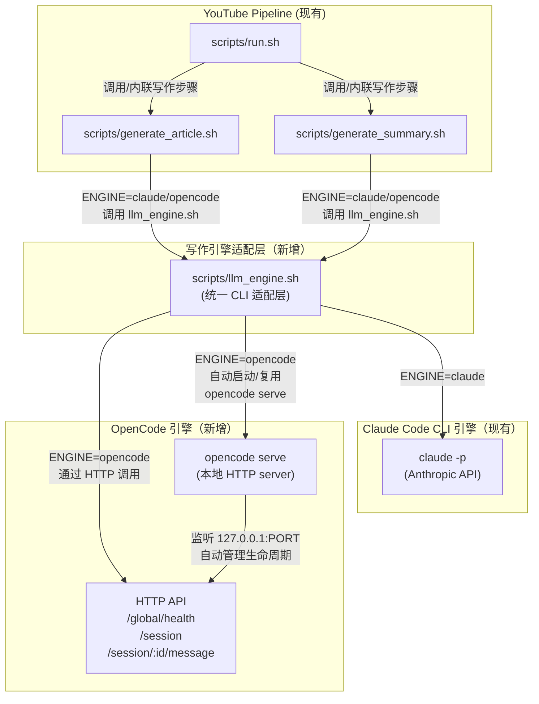

## 多引擎写作设计：引入 OpenCode 作为 Claude Code 的并行引擎

> **Goal**：在现有基于 Claude Code CLI 的流水线上，增加 OpenCode 作为可选写作引擎（目前支持 `claude` / `opencode` 两种），用于生成 `article.md` 与 `summary.md`，并保证在本地与「项目脏环境」下均可稳定调用。OpenCode 选用模型固定为 `minimax-cn-coding-plan/MiniMax-M2.5`。

> **Engine Mode**：OpenCode 采用 `opencode serve + HTTP` 方案，通过脚本自动启动、自动关闭本地 headless server（A1）。

---

## 1. 现状与问题

### 1.1 现有写作流程（Claude-only）

- **入口脚本**
  - `scripts/generate_article.sh`：从 `transcript/original_*.md` 生成 `writing/article.md`
  - `scripts/generate_summary.sh`：从 `writing/article.md` 生成 `writing/summary.md`
  - `scripts/run.sh`：
    - 在「STEP 3.5: Article Generation」阶段内联构造 prompt 并直接调用 `claude -p`
    - 在「STEP 4: Summary」阶段同样内联构造 prompt 并调用 `claude -p`
- **引擎耦合方式**
  - 上述三个路径都**直接写死** `claude -p --dangerously-skip-permissions`，并通过 `env ANTHROPIC_BASE_URL=...` 强制走官方 API。
  - 没有统一的「写作引擎适配层」，无法在不复制粘贴的前提下换成其他引擎。

### 1.2 OpenCode 可用性测试结论

#### 1.2.1 `opencode run`（直接 CLI）

- 在用户真实 TTY（`ttysXXX`）里：
  - 命令：
    - `opencode run -m "minimax-cn-coding-plan/MiniMax-M2.5" --format json --print-logs --log-level DEBUG "Reply with exactly: OK"`
  - 现象：
    - 能完整建立 session，加载 provider（包括 `minimax-cn-coding-plan`）。
    - 产出 JSON 事件，包含：
      - `{"type":"text", ... "text":"OK"}`
      - `{"type":"step_finish", ... "reason":"stop"}`
    - 退出前会清理 session/状态，整体 5 秒级完成。
  - 结论：**在真实交互终端内完全可用**。

- 在 Cursor 的非 TTY 自动化环境中：
  - 同一命令常见现象：
    - 仅打印初始 INFO 日志（version / args / bootstrapping 等），然后长期无输出、不退出。
    - 建立到 Cloudflare 段的 HTTPS 链接，但没有进一步可解析的 stdout/stderr 内容。
  - 使用 Python `pty.spawn([...])` 包一层：
    - 完全复现真实 TTY 的效果，能正确输出 JSON 事件和 `OK` 文本。
  - 结论：
    - `opencode run` **对 TTY/PTY 环境敏感**：在无 PTY 的场景下行为不可靠。
    - 若要在脚本/CI 中直接使用，需要额外封装（例如 Python PTY wrapper）。

#### 1.2.2 `opencode serve` + HTTP（headless）

- 在项目根目录（即「项目脏环境」）中：
  - 启动 server：
    - `OPENCODE_SERVER_PASSWORD="" opencode serve --hostname 127.0.0.1 --port 4097 --print-logs --log-level INFO`
    - 输出：`opencode server listening on http://127.0.0.1:4097`
  - 健康检查：
    - `GET /global/health` → `{"healthy":true,"version":"1.2.27"}`
  - 创建 session：
    - `POST /session` → 返回 `id=ses_...`, `directory="/Users/harveyzhang96/Projects/Video-Learner"`。
  - 发送消息（关键）：
    - 请求：
      - `POST /session/:id/message`
      - `Content-Type: application/json`
      - Body **必须**使用 `model` 对象，而非字符串：
        - ✅ 正确：
          - `"model": { "providerID": "minimax-cn-coding-plan", "modelID": "MiniMax-M2.5" }`
        - ❌ 错误：
          - `"model": "minimax-cn-coding-plan/MiniMax-M2.5"`（会被 schema 判为 `expected object, received string`）
      - 最小例子：
        - `{"parts":[{"type":"text","text":"Reply with exactly: OK"}],"model":{"providerID":"minimax-cn-coding-plan","modelID":"MiniMax-M2.5"}}`
    - 响应：
      - 顶层 `error` 字段为 `null` 或不存在。
      - `parts` 数组中包含 `type="text"` 且 `text="OK"`。
  - 结论：
    - 在 headless HTTP 模式下，OpenCode **稳定可用**，且不依赖 TTY。
    - 只要正确构造 `model` 对象，即可通过 HTTP 驱动 OpenCode 完成最小任务。

> **最终选型**：在多引擎写作中，OpenCode 采用 **`opencode serve + HTTP`** 模式，而不是直接依赖 `opencode run`（CLI + PTY）。

---

## 2. 目标与非目标

### 2.1 目标

- **G1：多引擎写作能力**
  - 支持两种写作引擎：
    - `claude`：沿用当前 Claude Code CLI 方案。
    - `opencode`：通过本地 `opencode serve` 实例 + HTTP API 完成生成。
  - 可配置/可切换（先用简单环境变量/脚本参数）。

- **G2：OpenCode 端到端可用性落地**
  - 在项目环境内提供一条可重复的 smoke test，验证：
    - `opencode serve` 可启动且 `/global/health` 正常。
    - `POST /session` + `POST /session/:id/message` 能完成一次「Reply with exactly: OK」调用。

- **G3：最小侵入改造现有写作脚本**
  - 尽量不破坏 `scripts/run.sh` / `scripts/generate_article.sh` / `scripts/generate_summary.sh` 的对外参数协议。
  - 将引擎差异集中封装在单一「引擎适配层」中。

### 2.2 非目标

- 不在本轮：
  - 修改 transcript/下载逻辑。
  - 改动 GUI/HTTP-server 的展示接口（仍然依赖 `writing/article.md` / `summary.md`）。
  - 引入第三引擎（例如 OpenAI API 直连）。

---

## 3. 高层架构设计

### 3.1 架构概览（mermaid）



### 3.2 关键抽象：`llm_engine.sh`

- 新增脚本：`scripts/llm_engine.sh`（命名暂定）
  - 职责：
    - **接收统一参数**：引擎类型、模型名（可选）、prompt（文件或 stdin）、可选输出路径/超时。
    - **分发到具体引擎**：
      - `ENGINE=claude` → 构造 prompt → 调用 `claude -p`。
      - `ENGINE=opencode` → 启动/检查 `opencode serve` → 调用 HTTP API → 抽取文本输出。
    - **屏蔽实现差异**：上层 `run.sh` / `generate_*` 只关心「给 prompt，拿文本」。

---

## 4. 引擎切换与配置策略

### 4.1 引擎选择

- 通过环境变量控制：
  - `WRITING_ENGINE=claude|opencode`
  - 默认值：`claude`（保持兼容）。
- 未来可在 `scripts/settings.conf` 或 `.env` 中集中配置。

### 4.2 模型配置

- **Claude 引擎**：
  - 沿用现有 Claude Code 配置（由 `claude` CLI 与 `.claude/settings.local.json` 等管理）。
  - 本设计不强制修改 Claude 模型名。

- **OpenCode 引擎**：
  - 固定使用：
    - `providerID = "minimax-cn-coding-plan"`
    - `modelID    = "MiniMax-M2.5"`
  - 在 `llm_engine.sh` 内写死该组合，**不对外暴露配置入口**（简化第一版）。
  - Smoke test 也使用相同模型，以保证路径一致。

---

## 5. OpenCode server 生命周期管理设计（A1 自动启动/自动关闭）

### 5.1 端口与地址

- 地址：`http://127.0.0.1:4097`
- 约定：
  - 写死一个「项目内约定端口」4097，避免与默认 4096 冲突（便于本地 TUI/Web 单独使用 4096）。
  - 若后续需要可配置，可通过 `WRITING_OPENCODE_PORT` 环境变量覆盖。

### 5.2 自动启动策略

在 `llm_engine.sh` 的 OpenCode 分支中实现以下逻辑（伪流程）：

1. **健康检查**：
   - `curl -sS http://127.0.0.1:$PORT/global/health`，超时时间推荐 1–2 秒。
   - 若返回 `{ healthy: true }`：
     - 直接复用现有 server，无需重新启动。
2. **启动 server**：
   - 若健康检查失败：
     - 在后台启动：
       - `OPENCODE_SERVER_PASSWORD="" opencode serve --hostname 127.0.0.1 --port $PORT --log-level INFO`
     - 等待 3–5 秒：
       - 轮询 `/global/health`，若成功则认为启动完成。
       - 若仍失败，则视为本次调用失败，返回错误（不要进入无限重试）。
3. **记录 server PID**：
   - 在当前项目临时目录（例如 `work/.opencode-server.pid`）记录启动的 server PID。
   - 若健康检查时发现服务正常，但 PID 文件缺失，可以选择不做任何事（服务可能由用户手动启动）。

### 5.3 自动关闭策略

考虑到本项目是「一次流水线即一次脚本运行」，自动关闭策略可以按「谨慎但简单」处理：

- 在一次写作调用链（article+summary）结束后：
  - 如果 server 是**本次脚本启动的**（即我们写了 PID 文件），则在脚本退出前尝试：
    - `kill $PID`（忽略失败）。
  - 若健康检查表明 server 是预先存在（没有 PID 文件或 PID 不匹配），则不尝试关闭，尊重用户手动管理。

> 备注：首次版本可以选择「仅自动启动，不自动关闭」，但根据你的偏好，这里将实现「自动启动 + 自动关闭」；实现时要注意区分「我启动的」 vs 「用户已有」。

### 5.4 错误处理与超时

- **启动失败**：
  - 清晰打印错误信息（engine=opencode, step=server_start）。
  - 返回非 0，允许上层流水线捕获并决定回退策略（例如回退到 Claude）。
- **HTTP 调用失败或超时**：
  - 超时建议：单次写作调用 120 秒；健康检查 1–2 秒。
  - 错误信息中包含：
    - HTTP 状态码。
    - 响应 body（截断到安全长度）。

---

## 6. 写作调用流程（Claude vs OpenCode）

### 6.1 通用流程抽象

统一以「prompt 文件」为单位，`llm_engine.sh` 接口大致如下：

```bash
# 伪接口
bash scripts/llm_engine.sh \
  --engine "$WRITING_ENGINE" \
  --input-prompt-file "$PROMPT_FILE" \
  --output-file "$OUTPUT_PATH"
```

其中：

- `PROMPT_FILE`：已经填充好具体路径/FOCUS/语言等的 prompt（对 Claude 和 OpenCode 共用）。
- `OUTPUT_FILE`：目标 `article.md` / `summary.md` 路径。

### 6.2 Claude 引擎分支（保持现状）

- 行为等价于当前实现：
  - `unset CLAUDECODE`
  - `env ANTHROPIC_BASE_URL="https://api.anthropic.com" claude -p --dangerously-skip-permissions < "$PROMPT_FILE" > "$OUTPUT_FILE"`
- 错误时：
  - 保持原有退出码语义。

### 6.3 OpenCode 引擎分支（HTTP 调用）

- 步骤：
  1. 调用「server 生命周期管理」模块：确保 `opencode serve` 在 `127.0.0.1:$PORT` 存在。
  2. 通过 HTTP 调用生成文本：
     - 创建 session：
       - `POST /session`，Body `{ "title": "video-learner-writing-<timestamp>" }`
     - 发 message：
       - `POST /session/:id/message`
       - Body：
         - `{"parts":[{"type":"text","text": "<PROMPT_CONTENT>"}],"model":{"providerID":"minimax-cn-coding-plan","modelID":"MiniMax-M2.5"}}`
       - 其中 `<PROMPT_CONTENT>` 为读取 `PROMPT_FILE` 后的完整文本内容。
     - 解析响应：
       - 从返回对象的 `parts` 数组中提取所有 `type="text"` 的 `text` 字段，按顺序拼接为输出正文。
  3. 将拼接结果写入 `OUTPUT_FILE`。

- 注意：
  - `PROMPT_FILE` 内容可能包含多行和 Markdown，需正确转义 JSON（建议 shell 侧使用 `jq -Rs` 辅助生成 JSON 字符串）。
  - 如需保留事件拆分结构，未来可以扩展为行级/块级处理，目前第一版可简单拼成一段 Markdown。

---

## 7. smoke test 设计（OpenCode 路径）

### 7.1 CLI 形式的最小可用性测试脚本

新增脚本（命名示例）：`scripts/test_opencode_smoke.sh`：

- 行为：
  1. 确保在项目根目录运行。
  2. 调用 `llm_engine.sh` 的 OpenCode 分支，构造一个简单 prompt（`Reply with exactly: OK`）。
  3. 读取输出：
     - 若去掉前后空白后等于 `OK`，则测试通过（退出码 0）。
     - 否则测试失败（退出码非 0，并打印诊断信息）。

- 诊断信息包括：
  - `opencode --version`
  - `opencode models minimax-cn-coding-plan | head`
  - `/global/health` 响应简要信息。

### 7.2 集成位置

- 可在本项目已有的 `scripts/test_full_e2e.sh` / `scripts/test_e2e.sh` 中增加一个可选 step：
  - 当环境变量 `TEST_OPEN_CODE=1` 时，执行 OpenCode smoke test。

---

## 8. 与现有流水线的改造点一览

> 下节不写具体实现步骤，只列出**需要改动的文件/位置**，供后续 implementation plan 使用。

- **新增文件**
  - `scripts/llm_engine.sh`：多引擎适配层。
  - `scripts/test_opencode_smoke.sh`：OpenCode smoke test。

- **改造文件**
  - `scripts/run.sh`
    - STEP 3.5 Article Generation：从直接调用 `claude` 改为构造 prompt 文件 + 调用 `llm_engine.sh`。
    - STEP 4 Summary：同上。
  - `scripts/generate_article.sh`
    - 将 `claude` 调用改为间接走 `llm_engine.sh`（或在文件内部调用统一适配层）。
  - `scripts/generate_summary.sh`
    - 同上。

- **配置/文档**
  - 在 `CLAUDE.md` 或 `docs/PROJECT_KNOWLEDGE.md` 中补充一小节：
    - 说明如何启用 OpenCode 引擎（`WRITING_ENGINE=opencode`）。
    - 说明 OpenCode 模型、依赖（本机必须已配置 minimax provider）。

---

## 9. 未来扩展与风险

### 9.1 扩展方向

- 支持更多 provider/model：
  - 将 `providerID` / `modelID` 提升为配置项（settings.conf / 环境变量）。
- 增加「回退策略」：
  - 当 OpenCode 调用失败时自动回退到 Claude。
- 将引擎层从 bash 抽到 Node 层：
  - 以便在 orchestrator 里直接统一管理写作任务。

### 9.2 风险点与缓解

- **Risk 1：OpenCode server 启动缓慢或失败**
  - 缓解：
    - 启动时增加有限次重试 + 清晰日志。
    - 保留纯 Claude 路径，必要时切回。

- **Risk 2：HTTP API schema 未来升级**
  - 当前依赖 `model` 为 `{providerID, modelID}` 对象。
  - 缓解：在 `llm_engine.sh` 中封装构造逻辑；若 schema 有变，仅需改一处。

- **Risk 3：OpenCode 返回多段文本/非预期结构**
  - 暂定策略：仅拼接 `type="text"` 的 `text`，并在异常时落盘原始 JSON 以便排查。

---

## 10. 总结

- 本设计在不破坏现有 Claude-only 流水线的前提下，引入一个「多引擎写作适配层」，通过环境变量控制使用 Claude 还是 OpenCode。
- OpenCode 路径采用 `serve + HTTP` 模式，解决了 `opencode run` 在无 TTY 环境下的不确定性问题，并通过自动启动/自动关闭本地 server 提供良好开发体验。
- 设计中明确了：
  - 可用性测试结论；
  - 引擎切换与模型策略；
  - OpenCode server 生命周期管理；
  - smoke test 与未来扩展方向。

