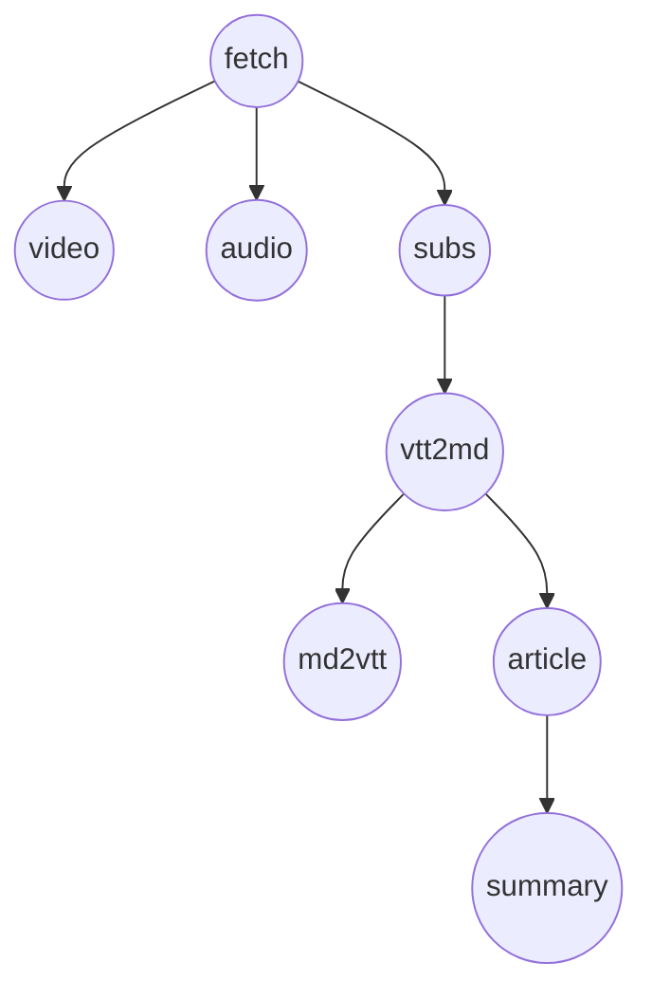

# 编排层 B：DAG / 调度（与必需物检查分离）

## 目的与范围

- **本文档**：描述 **B 层**——**何时允许调用某步**、**步骤之间的逻辑依赖**、**失败如何在依赖链上传播**，以及与 **执行顺序 / 是否并行** 的区分。
- **不包含**：单步「URL 是否有了、目录可写吗、`.vtt` 齐了吗」等 **A 层** 判定；见 **[runStep 必需物检查](2026-03-22-runstep-prerequisites.md)**。
- **关系**：调度器在放行 `runStep(taskId, step)` 之前可做 **B 检查**；`runStep` 入口再做 **A 检查**。二者都通过才 spawn 脚本。

路径约定：`work/<id>/`，`<id>` 为任务 ID；步骤名与 `core/orchestrator` 中 `STEPS` 一致。

---

## 状态权威

- **步骤生命周期**（`pending` / `running` / `completed` / `failed` / `skipped`）：以 **SQLite `steps` 表** 与编排内存为准（与现 `core/orchestrator` 一致）。
- **任务级字段**（`url`、`mode`、`force` 等）：**`tasks` 表** 与 `createTask` / `ensureTask` 参数。
- **B 层读写的主要是上述状态**；不替代 A 层对磁盘产物的检查。

---

## 逻辑 DAG（建议语义）

以下是有向边 **`前置 → 后继`**（「逻辑上后继应在前置满足后再调度」，具体由产品收紧或放宽）。

**`md2vtt` 与写作链解耦**：`md2vtt` 仅把逐字稿 **md → vtt**（便于播放/导出），**不是** `article` / `summary` 的前置。二者在 **`vtt2md` 完成之后** 仅共同依赖「已有 `original_*.md`」，**彼此无依赖**，B 层应允许 **并行** 调度（仍须分别通过 A 层必需物检查）。

| 边（依赖） | 含义（B 层） |
|------------|----------------|
| `fetch → video` / `fetch → audio` / `fetch → subs` | 产品默认：**先拉元数据、建目录与 DB 任务行**，再跑下载类步骤（与现 `runTask` 顺序一致）。 |
| `fetch → subs` 与 `fetch → video` | **互不依赖**；逻辑上可在 `fetch` 完成后 **并行** 调度 `subs` 与 `video`（若实现选择仍串行，属**执行策略**，不改变 DAG）。 |
| `subs → vtt2md` | 通常要求 **`subs` 为 `completed`**（或策略上允许「手工放入 VTT 跳过 subs」时，可改为「`subs` completed 或 subs 目录已有 VTT」——属 B 策略扩展）。 |
| `vtt2md → md2vtt` | 通常要求 **`vtt2md` 为 `completed`**（且 A 层有对应 `original_*.md`）。 |
| `vtt2md → article` | 通常要求 **`vtt2md` 为 `completed`**；**与 `md2vtt` 无先后关系**。 |
| （无）`md2vtt → article` / `md2vtt → summary` | **不存在**；`summary` **仅**依赖 `article` 产出 `article.md`。 |
| `article → summary` | 通常要求 **`article` 为 `completed`**。 |

**与 CLAUDE.md 对齐**：视频下载失败**不应**阻塞转录/总结——在 B 层应体现为：**`video` 的 `failed` 不阻塞 `subs → vtt2md → …` 链**（即 **`video` 不是 `subs` 的前驱**）。上图中 `video` / `audio` 与 `subs` 并列从 `fetch` 出发，已满足这一点。

---

## `mode` 与跳过（B 层）

| `mode` | B 层对步骤的默认态度（与现 `runStep` 对齐） |
|--------|---------------------------------------------|
| `both` | 启用 `video`；`audio` 可按产品二选一或并行（当前实现常只跑 `video`，不跑 `audio`，以代码为准）。 |
| `video` | 启用 `video`；**跳过** `audio`（`skipped`）。 |
| `audio` | 启用 `audio`；**跳过** `video`。 |
| `transcript` | **跳过** `video` 与 `audio`；从 `fetch` 后可直接进入 `subs` 链（须满足 A 层目录/URL）。 |

被 `skipped` 的节点**不**作为其后继的前置条件（视为已从图中移除或已满足）。

---

## 调度算法（建议）

1. **输入**：任务 `taskId`、`mode`、各 `steps` 状态。
2. **就绪集**：所有前驱（在 DAG 中、且未被 `mode` 跳过）均为 `completed` 或 `skipped` 的节点，且自身为 `pending` 或 `failed`（若允许重试）。
3. **执行策略（与逻辑 DAG 分离）**：
   - **串行**：从就绪集中按固定优先级选一个（例如现 `runTask` 顺序：`fetch` → 媒体 → `subs` → `vtt2md` → `md2vtt` → `article` → `summary`）。
   - **并行**：就绪集中 **DAG 上无路径相连** 的节点可同时 `runStep`（需进程与 DB 并发安全）。典型例子：`subs` 与 `video`（在 `fetch` 之后）；**`md2vtt` 与 `article`**（在 **`vtt2md` 之后**）。
4. **调用 `runStep` 前**：通过 **A 层**（必需物）；未通过则本步记 `failed` 或 `blocked`（若引入），**不** spawn。

---

## 失败传播（建议）

- **`failed` 仅阻塞 DAG 上的后继**（出边指向的节点）；**不**阻塞与失败节点**无路径**的步骤。
- 例：`video` `failed` 后，仍允许调度 `subs`（前驱仅 `fetch`）。
- 例：`subs` `failed` 后，默认**不应**调度 `vtt2md`（除非策略允许「无 subs、仅手工 VTT」并改边）。
- 例：**`md2vtt` `failed` 不阻塞 `article` / `summary`**（二者与 `md2vtt` 无 DAG 边）；反之 **`article` `failed` 仍阻塞 `summary`**。
- **任务整体 `status`**：可由产品定义为「任一步 `failed` 则任务 `failed`」或「关键路径失败才 `failed`」；与 B 层规则一并文档化。

---

## 与当前代码的关系

- **现状**：`runTask` 为 **固定线性** `await` 链，顺序为 `… → vtt2md → md2vtt → article → summary`，**未**利用「`md2vtt` ∥ `article`」；**尚未**实现独立 B 层模块（无就绪集、无并行调度、失败会打断后续 `await`）。
- **演进**：按本文 DAG，`vtt2md` 完成后可将 **`md2vtt` 与 `article` 并行**；**A 层**以 `assertStepArtifacts(taskId, stepName)` 形式挂在 `runStep` 入口。

---

## 维护与交叉引用

- **A 层（必需物）**：[2026-03-22-runstep-prerequisites.md](./2026-03-22-runstep-prerequisites.md)
- **流水线阶段说明**：`docs/PROJECT_KNOWLEDGE.md` 第四节
- 修改 DAG 或 `mode` 语义时，同步更新本文与 A 层文档中的「两层分工」表。
