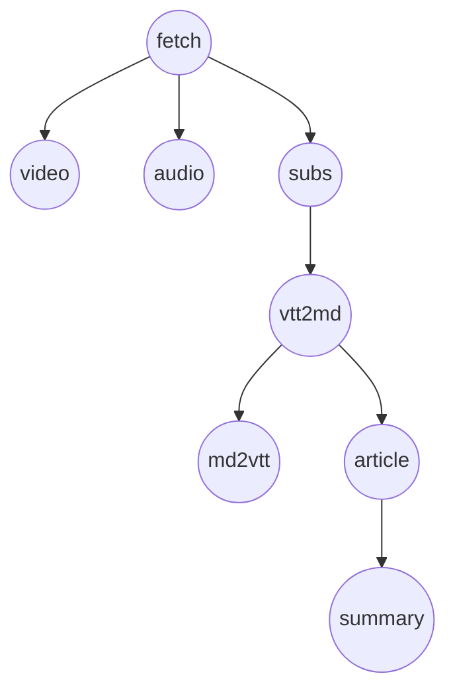

# 编排层 B：DAG / 调度（与必需物检查分离）

## 目的与范围

- **本文档**：描述 **B 层**——**何时允许调用某步**、**步骤之间的逻辑依赖**、**失败如何在依赖链上传播**，以及与 **执行顺序**（含单队列串行）的区分。
- **不包含**：单步「URL 是否有了、目录可写吗、`.vtt` 齐了吗」等 **A 层** 判定；见 **[runStep 必需物检查](2026-03-22-runstep-prerequisites.md)**。
- **关系**：调度器在放行 `runStep(taskId, step)` 之前可做 **B 检查**；`runStep` 入口再做 **A 检查**。二者都通过才 spawn 脚本。

路径约定：`work/<id>/`，`<id>` 为任务 ID；步骤名与 `core/orchestrator` 中 `STEPS` 一致。

---

## 状态权威

- **步骤生命周期**（`pending` / `running` / `completed` / `failed` / `skipped`）：以 **SQLite `steps` 表** 与编排内存为准（与现 `core/orchestrator` 一致）。
- **任务级字段**（`url`、`mode`、`force` 等）：**`tasks` 表** 与 `createTask` / `ensureTask` 参数。
- **B 层读写的主要是上述状态**；不替代 A 层对磁盘产物的检查。

---

## 逻辑 DAG（建议语义）

以下是有向边 **`前置 → 后继`**（「逻辑上后继应在前置满足后再调度」，具体由产品收紧或放宽）。

**`md2vtt` 与写作链解耦**：`md2vtt` 仅把逐字稿 **md → vtt**（便于播放/导出），**不是** `article` / `summary` 的前置。二者在 **`vtt2md` 完成之后** 仅共同依赖「已有 `original_*.md`」，**彼此无依赖**，B 层上二者可 **同时处于就绪**（无先后边）。**串行出队**时按下节 **序列优先级**：**`article` 属于主链，优先于 `md2vtt`**。

| 边（依赖） | 含义（B 层） |
|------------|----------------|
| `fetch → video` / `fetch → audio` / `fetch → subs` | 产品默认：**先拉元数据、建目录与 DB 任务行**，再跑下载类步骤（与现 `runTask` 顺序一致）。 |
| `fetch → subs` 与 `fetch → video` | **互不依赖**；`fetch` 完成后二者可 **同时就绪**。串行时用 **序列优先级**：**`subs`（主链）先于 `video`/`audio`（次优先）**，见「执行模型」。 |
| `subs → vtt2md` | 通常要求 **`subs` 为 `completed`**（或策略上允许「手工放入 VTT 跳过 subs」时，可改为「`subs` completed 或 subs 目录已有 VTT」——属 B 策略扩展）。 |
| `vtt2md → md2vtt` | 通常要求 **`vtt2md` 为 `completed`**（且 A 层有对应 `original_*.md`）。 |
| `vtt2md → article` | 通常要求 **`vtt2md` 为 `completed`**；**与 `md2vtt` 无先后关系**。 |
| （无）`md2vtt → article` / `md2vtt → summary` | **不存在**；`summary` **仅**依赖 `article` 产出 `article.md`。 |
| `article → summary` | 通常要求 **`article` 为 `completed`**。 |

**与 CLAUDE.md 对齐**：视频下载失败**不应**阻塞转录/总结——在 B 层应体现为：**`video` 的 `failed` 不阻塞 `subs → vtt2md → …` 链**（即 **`video` 不是 `subs` 的前驱**）。上图中 `video` / `audio` 与 `subs` 并列从 `fetch` 出发，已满足这一点。

---

## `mode` 与跳过（B 层）

| `mode` | B 层对步骤的默认态度（与现 `runStep` 对齐） |
|--------|---------------------------------------------|
| `both` | 启用 `video`；`audio` 可按产品二选一或并行（当前实现常只跑 `video`，不跑 `audio`，以代码为准）。 |
| `video` | 启用 `video`；**跳过** `audio`（`skipped`）。 |
| `audio` | 启用 `audio`；**跳过** `video`。 |
| `transcript` | **跳过** `video` 与 `audio`；从 `fetch` 后可直接进入 `subs` 链（须满足 A 层目录/URL）。 |

被 `skipped` 的节点**不**作为其后继的前置条件（视为已从图中移除或已满足）。

---

## 执行模型：单队列、串行 `runStep`（产品默认）

- **逻辑 DAG** 回答：在给定 `mode` 与各步状态下，**哪些步在 B 层意义上「可以调度」**（就绪），以及 **从某步重试时后继链路如何定义**（见下一节）。
- **运行时默认**：**单个执行者**，任意时刻**至多一个** `runStep` 在执行；用 **队列（或等价循环）** 维护「下一步跑谁」，避免多进程同时改同一任务的 `steps` 行与日志语义复杂化。
- **就绪 → 出队**：每步 **完成或失败** 后（或任务启动时），根据 DAG 重算 **就绪集**；在就绪集中取 **一个** 步名出队并调用 `runStep`。选取规则为 **序列优先级**（两档，见下），**不**采用「媒体夹在 subs 与 vtt2md 之间」的旧式线性表作为产品语义。
- **序列优先级（串行出队，产品约定）**  
  定义两条 **全序列表**（不含被 `mode` 跳过的步）；出队时在 **就绪集** 上选取 **唯一** 下一步：
  1. **主链（高优先级）**：`fetch` → `subs` → `vtt2md` → `article` → `summary`  
     对应「转录与写作」闭环，与 CLAUDE.md「先保证逐字稿与总结」一致。
  2. **次优先**：`video` → `audio` → `md2vtt`  
     - `video` / `audio` 按 `mode` 过滤；未启用的步不参与比较。若未来 `both` 同时启用二者，**同档内**保持 **`video` 先于 `audio`**（若有变更须同步本文与代码注释）。  
     - **`md2vtt` 整档低于主链**：故 `vtt2md` 完成后若 **`article` 与 `md2vtt` 同时就绪**，**先 `article` 后 `md2vtt`**。  
  **选取规则**：令 `R` 为就绪集。若 `R` 与主链列表的交非空，执行交集中 **在主链列表里最靠前** 的一步；否则若 `R` 与次优先列表的交非空，执行交集中 **在次优先列表里最靠前** 的一步；否则无步可出队。
- 若就绪集为空且仍有 `pending` 步，则任务 **blocked**（等待外部重试或人工修复），具体是否引入 `blocked` 状态由实现计划约定。
- **与文中「可同时就绪」的关系**：`subs` 与 `video`、`md2vtt` 与 `article` 等在 DAG 上 **无先后约束** 时，可能 **同时出现在就绪集**；串行实现用 **序列优先级** 决定谁先出队，**不**新增逻辑边。若将来引入 **多 worker 真并行**，仍须以 DAG 无冲突为前提，并保证 DB/事件顺序；**非默认路径**。

---

## 从指定 step 重试剩余链路（DAG 铺垫）

以下语义供 API / GUI「从某步继续」使用；具体参数名与是否暴露为 HTTP 在 **实现计划** 中定。

1. **为何需要 DAG**：重试不仅是「再调一次 `runStep`」，还要明确 **哪些后继** 在逻辑上应 **作废旧结果、重新跑**，避免「上游已变、下游仍 completed」不一致。
2. **建议默认——重置范围**：
   - 将起始步 **`S` 及 DAG 中所有从 `S` 经有向边可达的后继** 标为 `pending`（或允许重试的 `failed` 语义，与 SQLite 一致）；**不**自动重置 **`S` 的前驱**，除非另有 **`force`** 或单独「全量重跑」入口。
   - **例外（产品可收紧）**：若仅修复某步且确定下游输入不变，可只重置 `S`；须在文档与 UI 标明风险。
3. **与 `skipped` / `mode`**：被 `mode` 跳过的步保持 `skipped`，不参与「后继重置」的可达扩展（或等价于图中不存在该节点）。
4. **与队列衔接**：重置完成后，调度器用与上文相同的 **就绪集 + 序列优先级** 推进；仍 **每次一步**，直至无就绪且任务到达终态。
5. **与 A 层**：某步被调度时 **`runStep` 仍做必需物检查**；缺产物则失败，**不** spawn；是否自动阻塞整条队列由产品与实现约定。

---

## 调度算法（建议）

1. **输入**：任务 `taskId`、`mode`、各 `steps` 状态。
2. **就绪集**：所有前驱（在 DAG 中、且未被 `mode` 跳过）均为 `completed` 或 `skipped` 的节点，且自身为 `pending` 或 `failed`（若允许重试）。
3. **执行策略（与逻辑 DAG 分离）**：
   - **串行队列（默认）**：从就绪集中按 **序列优先级**（主链先于 `video`/`audio`/`md2vtt`，主链与次优先档内部顺序见「执行模型」）取 **一个** 执行。
   - **多步同时就绪**：仅表示就绪集中有多个候选；**默认实现**仍每次选一个，**不**同时 `runStep`。
   - **可选演进——真并行**：就绪集中 **DAG 上互不可达** 的节点可由多个 worker 同时 `runStep`（需进程与 DB 并发安全）。**非当前产品默认**；若启用，需另定与「主链优先」是否冲突的产物策略。
4. **调用 `runStep` 前**：通过 **A 层**（必需物）；未通过则本步记 `failed` 或 `blocked`（若引入），**不** spawn。

---

## 失败传播（建议）

- **`failed` 仅阻塞 DAG 上的后继**（出边指向的节点）；**不**阻塞与失败节点**无路径**的步骤。
- 例：`video` `failed` 后，仍允许调度 `subs`（前驱仅 `fetch`）。
- 例：`subs` `failed` 后，默认**不应**调度 `vtt2md`（除非策略允许「无 subs、仅手工 VTT」并改边）。
- 例：**`md2vtt` `failed` 不阻塞 `article` / `summary`**（二者与 `md2vtt` 无 DAG 边）；反之 **`article` `failed` 仍阻塞 `summary`**。
- **任务整体 `status`**：可由产品定义为「任一步 `failed` 则任务 `failed`」或「关键路径失败才 `failed`」；与 B 层规则一并文档化。

---

## 与当前代码的关系

- **现状**：`runTask` 为 **固定线性** `await` 链，顺序为 `fetch` → 媒体 → `subs` → `vtt2md` → **`md2vtt` → `article`** → `summary`。与本文 **序列优先级** 的差异在于：`vtt2md` 之后 **先跑 `md2vtt` 再跑 `article`**，而产品语义要求 **`article` 先于 `md2vtt`**（二者同时就绪时）。**尚未**实现独立 B 层模块（无显式就绪集、无「从某步重试」状态重置、失败会打断后续 `await`）。
- **演进（建议阶段）**：
  1. **B 层显式化 + 单队列**：用 DAG 判定就绪，用本文 **序列优先级** **串行** 出队（并视需要调整 `runTask` / Electron 侧顺序以与之一致）。
  2. **从指定 step 重试**：实现上一节重置范围 + 再次驱动队列。
  3. **可选**：真并行多 `runStep`（非默认）。**A 层**继续以 `runStep` 入口的必需物校验为准（见 A 层文档 / 实现）。

---

## 维护与交叉引用

- **A 层（必需物）**：[2026-03-22-runstep-prerequisites.md](./2026-03-22-runstep-prerequisites.md)
- **实现计划（B 层调度落地）**：[2026-03-22-orchestrator-dag-scheduler-implementation.md](./2026-03-22-orchestrator-dag-scheduler-implementation.md)
- **第二阶段（从某步重置后继 + HTTP）**：[2026-03-22-resume-from-step-design.md](./2026-03-22-resume-from-step-design.md)
- **流水线阶段说明**：`docs/PROJECT_KNOWLEDGE.md` 第四节
- 修改 DAG 或 `mode` 语义时，同步更新本文与 A 层文档中的「两层分工」表。
