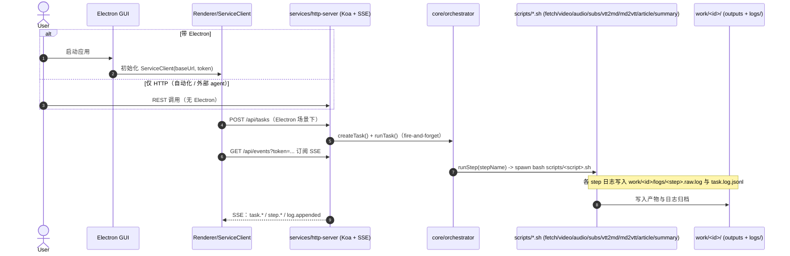

# 架构参考

> 面向「后来者」和「未来的自己」，希望在几分钟内弄清整个项目在做什么、长什么样、以及关键约束是什么。

---

## 一、项目概述

**Video-Learner** 是一个 YouTube 视频处理流水线工具，实现了从单个 YouTube URL 到「下载 → 字幕/转录 → 结构化文章 → 重点总结」的自动化流程，同时支持：

- **Electron 桌面客户端**：通过 GUI + 本地 HTTP/SSE + `core/orchestrator` + SQLite，对各步骤进行可视化编排与重试；
- **Agent Service（HTTP）**：同一编排内核，供 API / 外部 agent 驱动（无界面）。

**核心能力：**

1. **视频/音频下载**：使用 `yt-dlp` 下载最高 1080p，支持后台独立下载。
2. **双语字幕获取**：自动检测并下载中/英字幕，优先原创字幕，其次自动字幕。
3. **转录生成**：将 VTT 字幕转换为带 \[mm:ss\] 时间戳、自动去重的 Markdown 逐字稿。
4. **文章整理**：用 Claude 将逐字稿整理为结构化的 `article.md`。
5. **智能总结**：结合用户 FOCUS，生成包含 TL;DR / Outline / Key Points / Action Items / Terms 的 `summary.md`。
6. **任务管理 & GUI**：Electron 前端配合本地 orchestrator 与 HTTP + SSE（`services/http-server`），提供任务列表、进度与日志流、双语字幕切换等能力。

---

## 二、目录结构与职责

```bash
Video-Learner/
├── CLAUDE.md                  # 流水线执行标准 & meta 约定（强约束）
├── README.md                  # 对外 README（简略版）
├── package.json               # 根级 NPM 脚本：启动 Electron、安装依赖
├── scripts/                   # 分步 shell 脚本 + 工具（由编排层 spawn）
│   ├── run.sh                 # 【已废弃】薄壳；仅提示改用 GUI / Agent Service
│   ├── install.sh             # 安装系统依赖（yt-dlp / ffmpeg / jq 等）
│   ├── fetch_info.sh          # Step fetch：yt-dlp 拉取基础信息
│   ├── download_video.sh      # Step video：视频下载（合并流 + DASH 回退）
│   ├── download_audio.sh      # Step audio：音频下载/提取
│   ├── download_subs.sh       # Step subs：字幕下载（中/英）
│   ├── convert_vtt_md.sh      # Step vtt2md：VTT → Markdown 的封装
│   ├── translate_subs.sh      # Step translate：英文字幕 → 中文字幕（LLM 翻译）
│   ├── convert_md_vtt.sh      # Step md2vtt：Markdown → VTT 的封装
│   ├── llm_engine.sh          # 写作引擎路由：claude/opencode（统一入口）
│   ├── opencode_server.sh     # opencode serve 生命周期管理（ensure/health/stop）
│   ├── generate_article.sh    # Step article：通过 llm_engine 生成 article.md
│   ├── generate_summary.sh    # Step summary：通过 llm_engine 生成 summary.md
│   ├── vtt_converter.py       # 纯 Python：VTT → Markdown（去重/清洗）
│   ├── md2subtitle.py         # 纯 Python：Markdown → VTT/SRT
│   ├── db.sh                  # Bash 侧 SQLite 工具（tasks/steps/downloads）
│   ├── settings.example.conf  # 全局配置样例（输出语言、画质等）
│   └── settings.conf          # 全局配置（本机私有，不纳入版本控制）
├── core/
│   ├── id.js                  # 统一任务 ID 计算（sha1(url)[:12]）
│   └── orchestrator/          # 编排内核（DAG 调度、步骤执行、SQLite 读写）
├── services/
│   └── http-server/           # Koa HTTP API（调用 core/orchestrator）
├── electron/                  # Electron 桌面客户端
│   └── src/
│       ├── main.js            # 主进程：窗口 & IPC & WebSocket
│       ├── preload.js         # 暴露安全 API 给前端
│       ├── db.js              # Node 侧 SQLite 封装
│       ├── websocket-server.js# 本地 WebSocket server，向前端推日志和状态
│       ├── orchestrator.js    # 适配器：委托 core/orchestrator
│       └── renderer/
│           └── index.html     # 前端 UI（任务列表、详情、播放器、字幕区等）
├── harness/                   # 开发调试工具（见 harness/README.md）
├── start-electron.sh          # 从仓库根目录启动 Electron 的脚本
└── work/                      # 运行时输出（执行后生成，不纳入版本控制）
    ├── index.jsonl            # 任务索引（按行记录任务概况）
    ├── database.sqlite        # 任务/步骤状态数据库
    └── <id>/                  # 单个 URL 的输出树（id = sha1(url) 前 12 位）
        ├── media/
        │   ├── video.mp4
        │   ├── audio.m4a
        │   └── video_download.log
        ├── transcript/
        │   ├── subs/          # 原始字幕 vtt（区分 en/zh、orig/auto）
        │   ├── original_en.md # 英文逐字稿（带 [mm:ss]；去重）
        │   ├── original_zh.md # 中文逐字稿
        │   ├── original_en.vtt
        │   └── original_zh.vtt
        └── writing/
            ├── article.md     # 结构化文章
            └── summary.md     # 总结（受 FOCUS 影响）
```

---

## 三、运行模式与入口

- **正式入口（唯一实现路径）**
  - **GUI（Electron）**：`bash start-electron.sh`；前端通过 HTTP + SSE 与 `services/http-server` 通信，后者调用 `core/orchestrator`。
  - **Agent Service**：`npm run agent:serve`，直接暴露同一 HTTP API，无 Electron 亦可驱动任务。
  - 二者均将任务与步骤状态写入 **`work/database.sqlite`**，并 spawn 各 `scripts/*.sh` 完成实际下载与生成。
- **已废弃**：`scripts/run.sh` 现为薄壳（打印弃用说明、`exit 1`），不再调用任何步骤脚本。

### 3.1 调用链路时序图（GUI / Agent Service）



### 3.2 运行入口约定（重要）

- 新功能与修复应落在 **`core/orchestrator`** 或对应 **`scripts/<step>.sh`**，不要恢复与编排层并行的「一体化 shell 流水线」。
- `work/index.jsonl` 仍可由编排层追加（追溯）；**权威任务状态以 SQLite 为准**。
- **`runTask`（B 层串行调度）**：`createTask` 之后由 HTTP 或 Electron 触发；内部用 `core/orchestrator/schedule.js` 循环计算就绪集并按主链/次优先出队调用 `runStep`，直至无步可调度。
- **`runStep` A 层（必需物）**：在 spawn 各 `scripts/*.sh` 之前，校验 URL、任务目录可写或可创建、`transcript/subs` 下是否有 `.vtt`、`original_*.md`、`writing/article.md` 等；仅因 A 层失败时**不会**发出 `step.started`。

---

## 四、流水线阶段

### 4.1 任务参数

创建任务时的主要字段：

- **`url`**（必填）、**`focus`**、**`mode`**（`media` | `audio` | `transcript` | `full`，见 [adr/2026-04-13-mode-redesign.md](../adr/2026-04-13-mode-redesign.md)）、**`force`**、**`output_lang`**
- **`WRITING_ENGINE`**：通过进程环境变量传入，由 `scripts/llm_engine.sh` 与 `scripts/settings.conf` 中的 `WRITING_ENGINE_DEFAULT` 解析；支持 `claude` / `opencode`，非法或未设时回退 `opencode`

### 4.1.1 `force` 参数与各 Step

**`force` 从哪来**

1. **创建任务**（`POST /api/tasks`）：写入 SQLite / 内存中的 `task.params.force`。之后 `runTask` 调度到 `video` / `audio` 时，会把该值传入对应 `runStep`。
2. **单次执行某步**（`POST /api/tasks/:taskId/steps/:stepName/run` body `force`）：仅影响本次 `runStep`，**不会**自动回写 `task.params.force`。
3. **`reset_scope: downstream`**：HTTP 层不把本次请求 body 里的 `force` 合并进任务参数。

**编排层实际传参**

仅 **`video`**、**`audio`** 会把 `force` 编成脚本的最后一个参数 `'1'` / `'0'`。

**各 Step 行为摘要**

| Step | 是否传入 `force` | 行为说明 |
|------|------------------|----------|
| **video** | 是（第 4 参） | `FORCE=0` 且已存在足够大的 `media/video.mp4` 时**跳过下载**；`FORCE=1` 时**重新拉取**。 |
| **audio** | 已知问题 | 脚本内为 `FORCE="${3:-0}"`，而 `$3` 实际为任务 `id`，`$4` 才是 `force` 位且**脚本未读取**。因此 `force` 目前无法正确控制「已有 `audio.m4a` 是否跳过」；维护时应将 `download_audio.sh` 改为 `FORCE="${4:-0}"`。 |
| 其余 | 否 | 不受 `force` 影响。 |

### 4.2 执行阶段（逻辑视角）

1. **Step 0：获取信息（fetch）**：yt-dlp --dump-json 拉取标题、时长、语言等；计算 `id = sha1(url)[:12]`；建立 `work/<id>/` 目录。

2. **Step 1：视频下载（video）**：优先合并格式（progressive）；失败时回退 DASH + ffmpeg 合并；失败**不阻塞**后续转录/总结。

3. **Step 2：音频下载/提取（audio）**：`yt-dlp -x --audio-format m4a`；供未来接入 ASR 使用。

4. **Step 3：字幕下载 + 转录（subs + vtt2md）**：
   - 英文优先级：`en-orig` > `en`（auto）
   - 中文优先级：`zh-Hans`（orig/auto）> `zh`（auto）；繁体仅作最终兜底
   - VTT → `original_en.md` / `original_zh.md`（\[mm:ss\]，去重）
   - 反向生成 `original_en.vtt` / `original_zh.vtt`，方便前端播放

4.5. **Step 3.5：字幕翻译（translate）**：若字幕仅含英文（`original_en.md` 存在，`original_zh.md` 缺失）且 `output_lang=zh-CN`，则通过 LLM 将英文字幕翻译为中文，写入 `original_zh.md`；`md2vtt` 再将其转回 VTT。视频原生含中文字幕时此步骤自动跳过。

5. **Step 3.6：文章生成（article）**：源文件优先 `original_en.md`；模板 `scripts/article_prompt.txt`；写作引擎通过 `scripts/llm_engine.sh` 调用。

6. **Step 4：总结生成（summary）**：源文件 `writing/article.md`；结合用户 FOCUS；模板 `scripts/summary_prompt.txt`。

### 4.3 去重与复用

- 已存在且「足够完整」的输出（`video.mp4` 大于阈值、`original_en.md` 长度大于阈值）在 `FORCE=0` 时会被直接复用。
- `FORCE=1` 时，即使文件存在也会重新跑对应步骤。

---

## 五、Electron Orchestrator & GUI 架构

### 5.1 主要组件

- **主进程（`electron/src/main.js`）**：创建应用窗口；初始化 WebSocket server 与 orchestrator；暴露 IPC 通道给 renderer。
- **Orchestrator（`electron/src/orchestrator.js`）**：适配器，委托 `core/orchestrator`；提供 `run(url, options)` 与 `runStep(taskId, stepName, options)` 高层 API。
- **收尾（finalize）机制**：
  - 流水线跑完后，基于文件产物对 step 状态做一次一致性纠偏。
  - 发出 `task.finalized` 事件（包含关键 outputs 是否存在），让 GUI/SSE 订阅方拿到可靠的最终状态。
  - 若本次任务触发了 OpenCode serve，且没有其他任务在运行，则在 finalize 阶段尝试关闭 serve。

### 5.2 SQLite 状态存储（`work/database.sqlite`）

主要表结构（简化）：

- `tasks`：任务级信息（url / title / duration / created_at / focus / output_lang / mode / **status** 等）。
- `steps`：按 step 维度记录 `status`（pending/running/completed/failed）、`attempts`、`error` 等。
- `downloads`：视频下载详情（文件大小、格式、错误信息等）。

### 5.3 任务状态机

```
pending ──[run]──> running ──[complete]──> completed
                     │
                     ├──[abort]──> aborted ──[resume]──> running
                     │
                     └──[fail]──> failed
```

| 状态 | 含义 | 进入条件 |
|------|------|----------|
| `pending` | 等待执行（从未启动） | `createTask` 初始状态 |
| `running` | 流水线执行中 | `runTask` / `resumeTask` 触发 |
| `completed` | 全部步骤完成 | DAG 无可调度步骤、无失败 |
| `failed` | 有步骤失败终止 | 某步骤达到最大重试次数 |
| `aborted` | 用户主动中止 | `abortTask` 调用，持久化到 `tasks.status` |

`aborted` 与 `pending` 语义不同：前者代表"曾启动、被主动中止"，可通过 `resumeTask` 从中断处继续；后者代表"从未启动"。`failed` 不支持 resume，需手动通过 `reset_scope` 重置步骤。

**Resume 行为**：`resumeTask` 直接调用现有 `runTask()`。`computeReadySteps()` 天然跳过 `completed`/`skipped` 步骤，从所有前驱已完成的 `pending` 步骤继续执行，无需额外逻辑。

**操作守卫矩阵（aborted 任务）：**

| 操作 | 是否允许 | 错误码 |
|------|----------|--------|
| `resumeTask` | ✓ | — |
| `abortTask` | ✗ | `NOT_RUNNING` |
| `abortStep` | ✗ | `STEP_NOT_RUNNING` |
| `reset_scope` via HTTP | ✓（aborted 非 running，守卫通过） | — |

进程重启后：`loadTaskFromDb` 优先读 `tasks.status` 列中的 `'aborted'` 值（而非从步骤状态重新计算），保证 aborted 状态在重启后持久存在，等待用户手动点击继续。

### 5.4 WebSocket 通信

`electron/src/websocket-server.js` 将 orchestrator 的事件通过 WebSocket 推送给前端；前端订阅这些事件，实现进度条、日志流、状态标签等 UI。

### 5.5 前端（renderer/index.html）视角

典型布局（三栏 + 中间列四段式）：

- **左侧**：任务列表（按时间排序，可点击选中）。
- **中间**：主信息区（标题 + URL）→ 状态条（Step pill tags）→ 内容切换（Article/Summary）→ 内容区（Markdown 渲染）。
- **右侧**：视频播放器（本地 `file://` 播放）+ 控制条 + 字幕模块（多轨 VTT 列表、可点击跳转、画面内字幕开关）。

前端通过 HTTP API 调用 `GET /api/tasks/:taskId/media`、`GET /api/tasks/:taskId/subtitles`、`GET /api/tasks/:taskId/result/content?type=article|summary`；任务状态通过 **SSE**（`/api/events?token=...`）实时刷新。

### 5.6 下载失败排查

| 类型 | 典型表现 | 处理建议 |
|------|----------|----------|
| **资源问题** | yt-dlp 的 HTTP/429、地区限制、视频不可用、网络超时 | 换网络/VPN、换 URL、或改用「仅字幕」不下载媒体 |
| **Bash/脚本** | `syntax error`、`No such file`、脚本路径或参数错误 | 检查 `scripts/download_video.sh`、`scripts/db.sh`；对照 `work/<id>/logs/*.raw.log` |
| **架构/环境** | `command not found`、`yt-dlp: not found`、`ffmpeg: not found` | 子进程未继承完整 PATH；把所在目录加入系统 PATH 或重装依赖后重启应用 |

**YouTube 人机验证**：在 `scripts/settings.conf` 中设置 `YT_DLP_COOKIES_BROWSER=chrome`（或 `safari`/`firefox`/`edge`），或设置 `YT_DLP_COOKIES_FILE=/path/to/cookies.txt`。

---

## 六、数据与输出结构

```bash
work/
├── index.jsonl                    # 可选追溯索引
├── database.sqlite                # 任务/步骤/下载状态数据库
└── <id>/                          # id = sha1(url) 前 12 位
    ├── media/
    │   ├── video.mp4
    │   ├── audio.m4a
    │   └── video_download.log
    ├── transcript/
    │   ├── subs/                  # VTT 字幕原始文件
    │   ├── original_en.md         # 英文逐字稿（去重）
    │   ├── original_zh.md         # 中文逐字稿
    │   ├── original_en.vtt
    │   └── original_zh.vtt
    └── writing/
        ├── article.md             # 结构化文章
        └── summary.md             # 总结
```

### 逻辑 meta 结构

一个任务在任意运行模式下近似满足以下字段约定：

```json
{
  "url": "...",
  "id": "...",
  "ts": "...",
  "title": "...",
  "duration": "...",
  "lang": "en|zh|...",   // 视频语言，由 fetch_info 从 yt-dlp 元数据中提取（如 en-US → en），默认 en
  "output_lang": "zh-CN|en",
  "download_status": "pending|success|failed|skipped_existing",
  "download_attempts": 0,
  "download_error": "...",
  "transcript_source": "youtube_transcript|subtitle|existing|asr_missing|none",
  "transcript_done": true,
  "article_done": true,
  "summary_done": true,
  "focus": "...",
  "tool_versions": { "yt_dlp": "...", "ffmpeg": "...", "jq": "..." }
}
```

在实际实现中，这些字段拆分到 `tasks` / `steps` / `downloads` 多张表中，并结合 `work/<id>/` 产物。

---

## 七、关键设计决策

### 7.1 视频下载独立性

视频下载成功/失败**不影响** transcript 获取和总结。用户至少能获得「这视频讲了什么」，即便本地没有完整视频文件。

### 7.2 下载重试策略

- 第一次失败 → 立刻重试一次（清理半成品后重新下载）。
- 第二次仍失败 → 放弃，记录 `download_status=failed` 与 `download_error`。

### 7.3 双语字幕处理

- 英文：`en-orig` > `en`（auto）
- 中文（简体优先）：`zh-Hans`（orig/auto）> `zh`（generic auto）
- 中文（繁体兜底）：仅当英文与简体都缺失时，才尝试 `zh-TW`/`zh-Hant`

### 7.4 用户意图（FOCUS）

FOCUS 影响 `summary.md` 的侧重点与 Claude 提示词中各部分的篇幅分配。若缺少 FOCUS，允许先暂停在「等待 FOCUS」的状态，之后用户补充后再生成总结。

---

## 八、依赖与环境

- **系统工具**：`yt-dlp`、`ffmpeg`、`curl`、`jq`、`sqlite3`
- **语言运行时**：`bash`（所有 scripts/*.sh）、`python3`（vtt_converter.py / md2subtitle.py）、`node` + `npm`（Electron / orchestrator / WebSocket）
- **AI 相关**：Claude CLI（`claude`）、OpenCode CLI（`opencode`）

### 关键环境变量

| 变量 | 说明 |
|------|------|
| `WRITING_ENGINE` | 单次覆盖写作引擎（`claude` / `opencode`）；优先级高于 `WRITING_ENGINE_DEFAULT` |
| `WRITING_ENGINE_DEFAULT` | 全局默认写作引擎（写入 `scripts/settings.conf`）；缺省或非法时回退为 `opencode` |
| `OPENCODE_HOST` / `OPENCODE_PORT` | OpenCode serve 监听地址（默认 `127.0.0.1:4097`） |
| `ANTHROPIC_BASE_URL` | 部分宿主环境设为代理地址；脚本侧调用 `claude` 时强制使用 `https://api.anthropic.com` |

完整部署说明见 [how-to/deploy.md](../how-to/deploy.md)。

---

## 九、总结模板结构（summary.md）

```markdown
# Summary

## TL;DR
[一句话总结]

## Outline
1. [主要章节/要点，按时间顺序]

## Key Points
- [关键要点1] [时间戳]
- [关键要点2] [时间戳]

## Action Items
- [行动项1]

## Terms/Entities
- [术语1]: [定义]
```

---

## 十、给维护者的注意事项

1. **分支与合并规范**：任何开发都必须在 `feature/*` 或 `hotfix/*` 上进行，禁止直接在 `master` / `staging` 开发；合并时禁止 fast-forward，须 `git merge --no-ff`（见 [explanation/git-workflow.md](../explanation/git-workflow.md)）。
2. **下载独立性**：不要引入「视频下载失败就终止后续步骤」的逻辑，始终保证至少能拿到 original.md + summary.md。
3. **复用机制**：新增逻辑时优先复用已有输出，注意与 `force` / `FORCE`、SQLite 状态保持一致；**`force` 语义与各 Step 对照表见 §4.1.1**。
4. **FOCUS 重要性**：任何与 summary 相关的改动，都要考虑没有 FOCUS、补充 FOCUS 之后、重复运行等场景。
5. **契约文档**：修改流水线的状态字段或输出结构时，务必同步更新 `CLAUDE.md` 与本文件中对应章节。
6. **Agent Service**：修改 `core/orchestrator` 或 HTTP 路由时，注意保持与 Electron 适配器及 SQLite 持久化约定一致；新增 API 或字段时在 [reference/api.md](api.md) 中补充说明。
7. **写作引擎一致性**：文章/总结生成应统一走 `scripts/llm_engine.sh`；新增引擎或调整默认值时，同步更新 `scripts/settings.example.conf`、`CLAUDE.md` 与本文相关章节。
8. **编排层 finalize 语义**：若改动 step 状态机或输出路径，确认 finalize 的"产物与状态纠偏"仍成立，并确保 `task.finalized` 事件语义对上游订阅方保持稳定。
